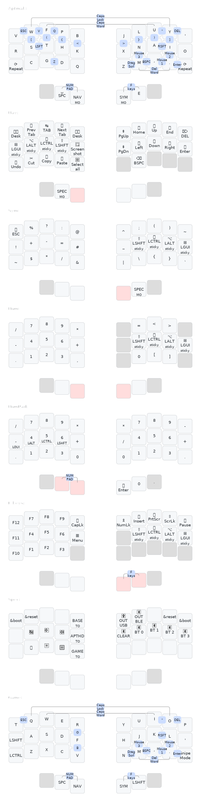
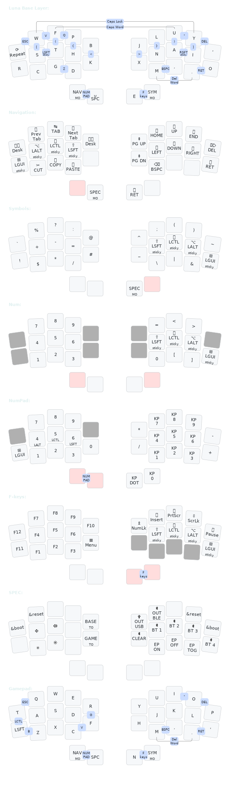

## Layout for [BastardKB](https://bastardkb.com) boards (and other 3x5+2)

The layout has coverage of near 100% of all the keys present on a standard 100% ANSI keyboard in the span of 6 layers and 4 thumb keys - the main exceptions being AltGr, RCtrl, RGui - without using Layer Taps or Mod Taps except on the NumPad Layer. This is done by using Tri Layers and thumb combos.

The base layer is [Aptmak](https://github.com/Apsu/aptmak), with V, Q, and Z, on combos as an adaptation to allow support on 30 key (23332) layouts like [Hummingbird](https://github.com/PJE66/hummingbird), [Batreeq](https://github.com/AlaaSaadAbdo/battoota#batreeq), [Rommana](https://github.com/AlaaSaadAbdo/Rommana), or [Luna](https://github.com/mindhatch/keyboards#%E3%83%AB%E3%83%8A-luna), with minimal modifications.

## Keymap (generated with Caksoylar's [keymap-drawer](https://github.com/caksoylar/keymap-drawer))

### [34 key (3x5+2)](./assets/split34_keymap_zmk.yaml)

### [30 key (23332+2)](./assets/split30_keymap.yaml)
